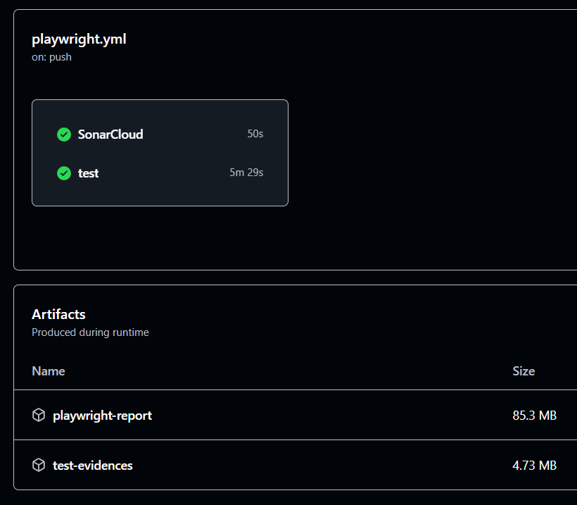

# taller-playwright-pokemon-showdown

 

Este repositorio resuelve el taller de automatización de pruebas para Pokémon Showdown utilizando Playwright, para completar la actividad asignada para las sesiones 3-4 del curso de Testing en EAFIT.

## Reto planteado

El propósito de este proyecto es utilizar las capacidades de Playwright para automatizar un flujo y realizar dos pruebas que validen el éxito de la ejecución. El reto es Crear un equipo de Pokemones usando la aplicación 'Team Builder' del sitio web [Pokémon Showdown](https://pokemonshowdown.com/)

## Estructura del proyecto

- *Configuración de Playwright*:
  - [playwright.config.ts](playwright.config.ts)
- *Datos del equipo a conformar*:
  - [pokemon-team.json](data/pokemon-team.json) 
- *Tipado de la datos*:
  - [types/pokemon-team.type.ts](types/pokemon-team.type.ts)
  - [types/pokemon.type.ts](types/pokemon.type.ts)
- *Páginas, en conformidad con el patrón POM*:
  - [pages/showdown-home.page.ts](pages/showdown-home.page.ts)
  - [pages/showdown-team-list.page.ts](pages/showdown-team-list.page.ts)
  - [pages/showdown-team-creation.page.ts](pages/showdown-team-creation.page.ts)
  - [pages/showdown-pokemon-configuration.page.ts](pages/showdown-pokemon-configuration.page.ts)
- *Especificación del caso de pruebas - Crear un equipo*:
  - [tests/create-team.spec.ts](tests/create-team.spec.ts)

## Datos del equipo a conformar: [Gen 8] OU

Los datos provistos para la realización de la prueba se guardaron en formato JSON y se pueden visualizar fácilmente en la siguiente tabla:

<table>
  <thead>
    <tr>
      <th>Nombre</th>
      <th>Item</th>
      <th>Ability</th>
      <th>Moves</th>
      <th>HP</th>
      <th>Atk</th>
      <th>Def</th>
      <th>SpA</th>
      <th>SpD</th>
      <th>Spe</th>
    </tr>
  </thead>
  <tbody>
    <tr>
      <td>Landorus-Therian</td>
      <td>Leftovers</td>
      <td>Intimidate</td>
      <td>
        <ul>
          <li>Earthquake</li>
          <li>Knock Off</li>
          <li>Stealth Rock</li>
          <li>U-turn</li>
        </ul>
      </td>
      <td>248</td>
      <td>0</td>
      <td>172</td>
      <td>0</td>
      <td>0</td>
      <td>88</td>
    </tr>
    <tr>
      <td>Tornadus-Therian</td>
      <td>Heavy-Duty Boots</td>
      <td>Regenerator</td>
      <td>
        <ul>
          <li>Defog</li>
          <li>Focus Blast</li>
          <li>Heat Wave</li>
          <li>Hurricane</li>
        </ul>
      </td>
      <td>0</td>
      <td>0</td>
      <td>0</td>
      <td>252</td>
      <td>4</td>
      <td>252</td>
    </tr>
    <tr>
      <td>Heatran</td>
      <td>Leftovers</td>
      <td>Flash Fire</td>
      <td>
        <ul>
          <li>Earth Power</li>
          <li>Lava Plume</li>
          <li>Protect</li>
          <li>Toxic</li>
        </ul>
      </td>
      <td>252</td>
      <td>0</td>
      <td>0</td>
      <td>248</td>
      <td>8</td>
      <td>0</td>
    </tr>
    <tr>
      <td>Kartana</td>
      <td>Choice Scarf</td>
      <td>Beast Boost</td>
      <td>
        <ul>
          <li>Knock Off</li>
          <li>Leaf Blade</li>
          <li>Sacred Sword</li>
          <li>Smart Strike</li>
        </ul>
      </td>
      <td>0</td>
      <td>252</td>
      <td>4</td>
      <td>0</td>
      <td>0</td>
      <td>252</td>
    </tr>
    <tr>
      <td>Tapu Fini</td>
      <td>Leftovers</td>
      <td>Misty Surge</td>
      <td>
        <ul>
          <li>Calm Mind</li>
          <li>Draining Kiss</li>
          <li>Nature's Madness</li>
          <li>Taunt</li>
        </ul>
      </td>
      <td>252</td>
      <td>0</td>
      <td>0</td>
      <td>0</td>
      <td>252</td>
      <td>4</td>
    </tr>
    <tr>
      <td>Rillaboom</td>
      <td>Choice Band</td>
      <td>Grassy Surge</td>
      <td>
        <ul>
          <li>Grassy Glide</li>
          <li>Knock Off</li>
          <li>Superpower</li>
          <li>U-turn</li>
        </ul>
      </td>
      <td>0</td>
      <td>252</td>
      <td>0</td>
      <td>0</td>
      <td>4</td>
      <td>252</td>
    </tr>
  </tbody>
</table>

## Orden de la ejecución del caso de prueba

Se realizaron los siguientes pasos en la especificación de la prueba:

1. Crear equipo
2. Nombrar el equipo
3. Escoger el formato a trabajar
4. _Tomar la evidencia en imagen_
5. Iterar con los seis personajes para:
   1. Seleccionar Pokémon
   2. Asignar el item
   3. Definir habilidad
   4. Asignar movimientos
   5. Definir las estadísticas o Evs
   6. **Realizar la aserción para validar que los Evs fueron usados en totalidad**
   7. _Tomar la evidencia en imagen_
6. **Realizar la aserción para verificar la validez del equipo**
7. _Tomar la evidencia en imagen_

## Presentación de evidencias de ejecución exitosa

  

    
Creación del equipo: <b>[Gen 8] OU</b>

    
  

  

    
Validación final de ejecución exitosa: <b>Equipo [Gen 8] OU válido</b>

    
  

<h3>Detalle de la creación de cada Pokémon</h3>

  

    
Creación del Pokemon 1: <b>Landorus Therian</b>

    
  

  

    
Creación del Pokemon 2: <b>Tornadus Therian</b>

    
  

  

    
Creación del Pokemon 3: <b>Heatran</b>

    
  

  

    
Creación del Pokemon 4: <b>Kartana</b>

    
  

  

    
Creación del Pokemon 5: <b>Tapu Fini</b>

    
  

  

    
Creación del Pokemon 6: <b>Rillaboom</b>

    
  

## Instalación y ejecución de la prueba

Para ejecutar el caso de prueba, realiza los siguientes pasos:
1. *Clona el proyecto*:
   `git clone <repo_url>`

2. *Instala las dependencias*:
   `npm install`

2. *Ejecuta las pruebas*:
   `npx playwright test` (Opcional el flag `--ui`)

3. *Verifica los resultados*:
   En cada ejecución de las pruebas, el reporte se genera en el directorio `playwright-report/.` Al interior de este, el archivo `index.html` se puede abrir para ver un informe detallado de las pruebas.

   Cada ejecución regenera las imágenes de evidencia en la carpeta `./evidences`

## Extras

### CI con Github Actions

Agregamos un pipeline que se ejecuta con cada push que realizamos sobre la rama `main`. Pueden ver el historial en el enlace de [acciones](https://github.com/ayalamac/taller-playwright-pokemon-showdown/actions).

#### Generación de artefactos de reporte y de evidencia

La ejecución correcta del pipeline de automatización de CI genera al final del build los siguientes artefactos:

- Reporte de resultados de la prueba
- Evidencias en imagen de ejecución y prueba exitosa

Pueden ver el historial de ejecuciones, las ejecuciones exitosas y los artefactos generados.

### SAST con Sonarcloud

Agregamos la ejecución de pruebas estáticas de calidad en Sonarcloud y el proyecto se puede ver en el siguiente enlace:

[https://sonarcloud.io/summary/overall?id=eafit-topicos-avanzados-testing_taller-playwright-pokemon-showdown](https://sonarcloud.io/summary/overall?id=eafit-topicos-avanzados-testing_taller-playwright-pokemon-showdown)

## Requisitos

- Node.js (versión 16 o superior)

## Autores

Todo el trabajo fue realizado con prácticas de *pair programming*, aprovechando el plugin [Live Share de VSCode](https://visualstudio.microsoft.com/services/live-share/) y los *commits* del proyecto han sido realizados usando la coautores de Github.

- Andrés Ayala <amayalac@eafit.edu.co>
- Santiago Patiño <spatinob1@eafit.edu.co>

## Licencia

Este proyecto es un trabajo académico y está bajo la licencia MIT. Consulta el archivo [LICENSE](LICENSE) para más detalles.